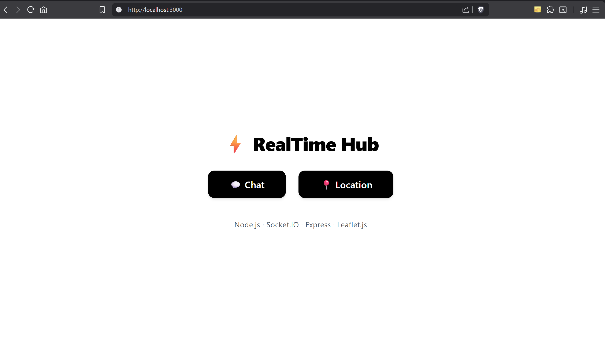
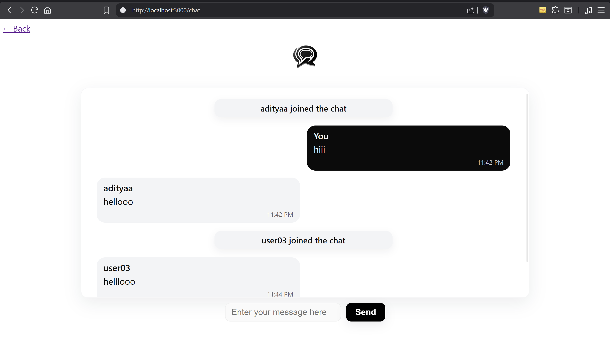
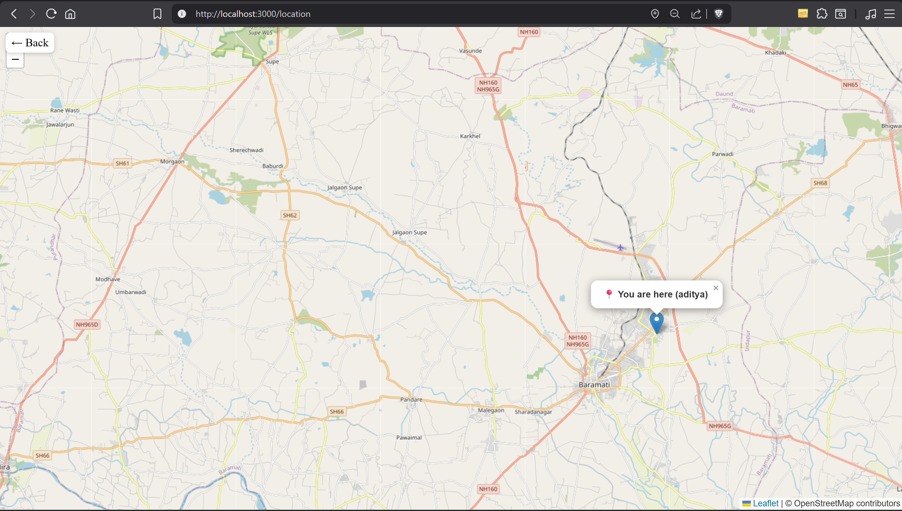

  # 💬📍 RealTime Hub — Chat & Location Sharing System

### Real-time Chat and Live Location Sharing Web App

**RealTime Hub** is a lightweight full-stack web application that enables users to:
- 💬 Chat instantly with others using **Socket.IO**
- 📍 Share their live location on an interactive map using **Leaflet.js**

---

## 🚀 Tech Stack

**Frontend:** HTML, CSS, EJS  
**Backend:** Node.js, Express.js  
**Real-Time Engine:** Socket.IO  
**Map Library:** Leaflet.js  

---

## ⚙️ Features

- 🔄 Real-time chat messaging without page reload  
- 📡 Live GPS-based location tracking  
- 👋 Join and leave notifications  
- ⚡ Event-driven architecture with Socket.IO  
- 🎨 Clean, minimal, and responsive user interface (light & dark theme)  

---

## 🧩 How It Works

1. When a user joins the chat, the server establishes a dedicated socket connection.  
2. Messages are transmitted and received instantly using **Socket.IO** events.  
3. For location tracking, the browser’s geolocation API continuously sends coordinates to the server.  
4. The server broadcasts each update to all connected users in real time.  

---

## 📸 Screenshots
**Home Page**

**Chat Interface**

**Location Map**

---

## 🧠 Learning Outcomes

- Understood real-time data flow using **WebSockets (Socket.IO)**  
- Gained hands-on experience with **Express.js routing and event handling**  
- Integrated backend–frontend communication for a seamless live experience  
- Built an end-to-end **real-time full-stack system**  

---

## 🔧 How to Run Locally

1. Install dependencies using `npm install`  
2. Start the server with `node app.js`  
3. Open **http://localhost:3000** in your browser  

---

